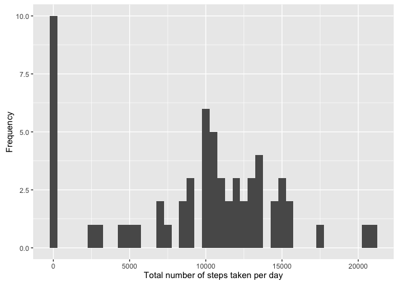
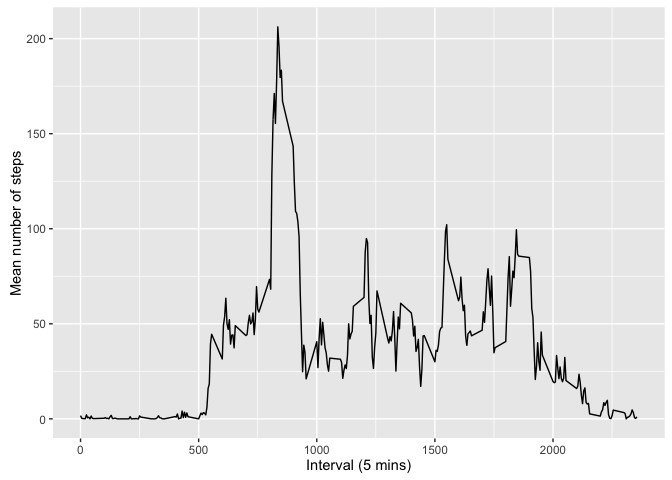
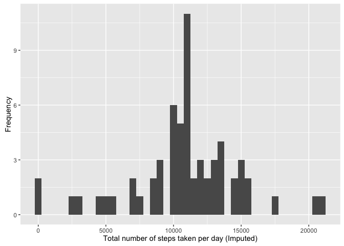
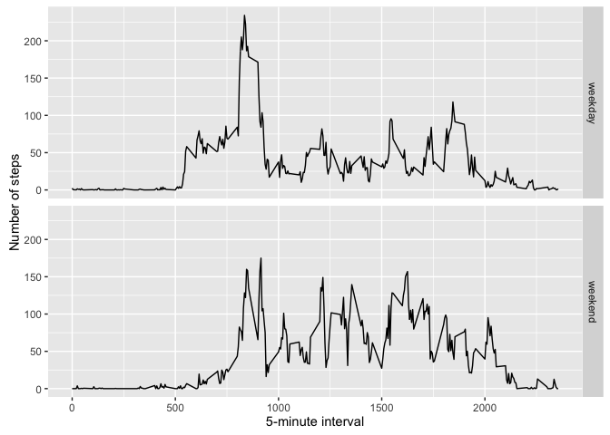

Loading and preprocessing the data
==================================

Show any code that is needed to

1.  Load the data (i.e. read.csv())

<!-- -->

    setwd("/Users/JCN/Desktop/Coursera/5 Reproducible Research/")
    Data <- read.csv("activity.csv")

What is the mean total number of steps taken per day?
=====================================================

For this part of the assignment, you can ignore the missing values in
the dataset.

1.  Calculate the total number of steps taken per day

<!-- -->

    library(ggplot2)

    ## Warning: package 'ggplot2' was built under R version 3.2.4

    StepsPerDay <- tapply(Data$steps, Data$date, FUN=sum, na.rm=TRUE)

1.  If you do not understand the difference between a histogram and a
    barplot, research the difference between them. Make a histogram of
    the total number of steps taken each day

<!-- -->

    qplot(StepsPerDay, binwidth = 500, xlab='Total number of steps taken per day', ylab='Frequency')

<!-- -->

1.  Calculate and report the mean and median of the total number of
    steps taken each day

<!-- -->

    mean(StepsPerDay)

    ## [1] 9354.23

    median(StepsPerDay)

    ## [1] 10395

What is the average daily activity pattern?
===========================================

1.  Make a time series plot (i.e. 𝚝𝚢𝚙𝚎 = "𝚕") of the 5-minute
    interval (x-axis) and the average number of steps taken, averaged
    across all days (y-axis)

<!-- -->

    AveSteps5min <- aggregate(x=list(meanSteps=Data$steps), by=list(interval=Data$interval), FUN=mean, na.rm=TRUE)

    ggplot(data=AveSteps5min, aes(x=interval, y=meanSteps)) + geom_line() +
            xlab("Interval (5 mins)") + ylab("Mean number of steps")

<!-- -->

1.  Which 5-minute interval, on average across all the days in the
    dataset, contains the maximum number of steps?

<!-- -->

    mostSteps <- which.max(AveSteps5min$meanSteps)
    timeMostSteps <- gsub("([0-9]{1,2})([0-9]{2})","\\1:\\2", AveSteps5min[mostSteps, 'interval'])
    timeMostSteps

    ## [1] "8:35"

Imputing missing values
=======================

Note that there are a number of days/intervals where there are missing
values (coded as 𝙽𝙰). The presence of missing days may introduce bias
into some calculations or summaries of the data.

1.  Calculate and report the total number of missing values in the
    dataset (i.e. the total number of rows with 𝙽𝙰s)

<!-- -->

    missing <- is.na(Data$steps)
    table(missing)

    ## missing
    ## FALSE  TRUE 
    ## 15264  2304

1.  Devise a strategy for filling in all of the missing values in
    the dataset. The strategy does not need to be sophisticated. For
    example, you could use the mean/median for that day, or the mean for
    that 5-minute interval, etc.

The NA values will be imputed with mean values as per the coding below.

1.  Create a new dataset that is equal to the original dataset but with
    the missing data filled in.

<!-- -->

    library(scales)
    library(Hmisc)

    ## Warning: package 'Hmisc' was built under R version 3.2.5

    ## Loading required package: lattice

    ## Loading required package: survival

    ## Loading required package: Formula

    ## 
    ## Attaching package: 'Hmisc'

    ## The following objects are masked from 'package:base':
    ## 
    ##     format.pval, round.POSIXt, trunc.POSIXt, units

    DataImputed <- Data
    DataImputed$steps <- impute(Data$steps, fun=mean)

1.  Make a histogram of the total number of steps taken each day and
    calculate and report the mean and median total number of steps taken
    per day. Do these values differ from the estimates from the first
    part of the assignment? What is the impact of imputing missing data
    on the estimates of the total daily number of steps?

<!-- -->

    TotalStepsImputed <- tapply(DataImputed$steps, DataImputed$date, sum)
    qplot(TotalStepsImputed, binwidth = 500, xlab='Total number of steps taken per day (Imputed)', ylab='Frequency')

<!-- -->

    mean(TotalStepsImputed)

    ## [1] 10766.19

    median(TotalStepsImputed)

    ## [1] 10766.19

Both the mean and median are higher after the NA values have been
imputed. The reason for this is that before they have been imputed they
have been taken as 0 and this calculates a lower mean and median than
when they have been imputed by mean values.

Are there differences in activity patterns between weekdays and weekends?
=========================================================================

For this part the 𝚠𝚎𝚎𝚔𝚍𝚊𝚢𝚜() function may be of some help here. Use the
dataset with the filled-in missing values for this part.

1.  Create a new factor variable in the dataset with two levels –
    “weekday” and “weekend” indicating whether a given date is a weekday
    or weekend day.

<!-- -->

    TypeOfDay <- function(date) {
        day <- weekdays(date)
        if (day %in% c("Monday", "Tuesday", "Wednesday", "Thursday", "Friday")) 
            return("weekday") else if (day %in% c("Saturday", "Sunday")) 
            return("weekend") else stop("invalid date")
    }
    Data$date <- as.Date(Data$date)
    Data$day <- sapply(Data$date, FUN = TypeOfDay)

1.  Make a panel plot containing a time series plot (i.e. 𝚝𝚢𝚙𝚎 = "𝚕") of
    the 5-minute interval (x-axis) and the average number of steps
    taken, averaged across all weekday days or weekend days (y-axis).
    See the README file in the GitHub repository to see an example of
    what this plot should look like using simulated data.

<!-- -->

    averages <- aggregate(steps ~ interval + day, data = Data, mean)
    ggplot(averages, aes(interval, steps)) + geom_line() + facet_grid(day ~ .) + 
        xlab("5-minute interval") + ylab("Number of steps")

<!-- -->
